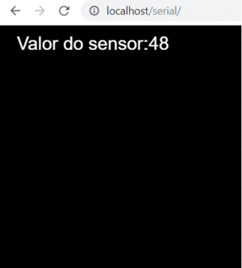
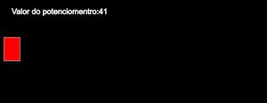
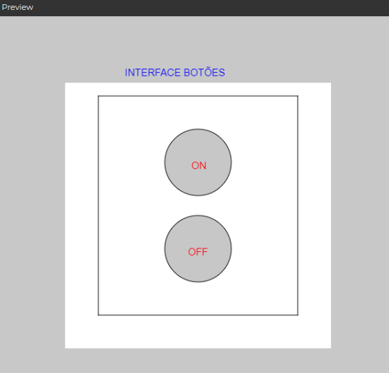
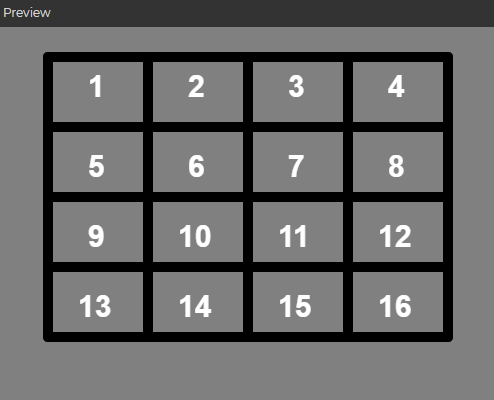

# 📚Caderno de Estudos de Internet das Coisas 

> Este documento reúne algorítimos e aplicações em javascript e arduino.  

> Autor: Iury Coelho.

### Referências p5.js
<details>
<summary>desenho</summary>
 
* [`createCanvas`](#createCanvas)
* [`createGraphics`](#createGraphics`)


</details>

<details>
<summary>entrada</summary>
 
* [`createInput`](#createInput)
* [`createButton`](#createButton`)


</details>


### Códigos

<details>
<summary>interface com p5.js</summary>
 
* [`desenhado_botoes`](#interface_botoes)
* [`desenhado_teclado_numerico`](#interface_teclado_numerico)


</details>

 
<details>
<summary>conectando porta serial e webBrowser com p5.js</summary>
 
* [`introdução`](#introdução)
* [`funções`](#funcoes)


</details>

<details>
<summary>lendo valor de sensor pela porta serial com p5.js e arduino</summary>
 
* [`app_arduino_serial`](#app_arduino_serial)

</details>

<details>
<summary>potenciometro webBrowser com p5.js e arduino</summary>
 
* [`app_arduino_potenciometro_js`](#app_arduino_potenciometro_js)


</details>

 
<details>
<summary>escrevendo na porta serial com botão interativo p5.js e arduino</summary>
 


</details>

### 📜introdução
> antes de tudo...

- baixe : https://github.com/p5-serial/p5.serialcontrol/releases
- esse app concede a comunicação com as portas seriais disponíveis.
- baixe a biblioteca p5.js: https://github.com/iuryeng/IoT/blob/master/p5js_app/p5.serialport.js
- importe a biblioteca no index.html com: <script src="p5.serialport.js"></script>
- você pode rodar seu scketch aqui : https://editor.p5js.org/

<br>[⬆ volte ao topo](#conteúdo)

### 🎛️funcoes
> chame as funções para responder os eventos

- list: retorna a lista de portas.       
- connected: conecta um websocket pela porta serial
- open: abre uma porta serial
- close: fecha uma porta serial
- data: dados que chegam na porta serial
- error: algum erro ocorreu.

```js
> construção de funções

function conexaoServidor() {
  console.log('servidor conectado');
}
 
function abrirPorta() {
  console.log('A porta serial está aberta.')
}
 
function serialArduino() {
 // leitura de valores do arduino
}
 
function erroSerial(erro) {
  console.log('ocorreu um erro. ' + erro);
}
 
function fecharPorta() {
  console.log('A porta serial está fechada.');
}

```

> exemplo de chamada de funções 
```js
function setup() {
  serial = new p5.SerialPort();              // instacia uma nova serial port
  serial.on('list', printList);             // chama a função list
  serial.on('connected', conexaoServidor); // chama a função connected
  serial.on('open', abrirPorta);          // chama a função open
  serial.on('data', serialArduino);      // recolhe dados a partir de eventos na serial
  serial.on('error', erroSerial);       // chama a função error
  serial.on('close', fecharPorta);     // chama a função close 
  serial.list();                      // lista as portas seriais
  serial.open(portaSerial);          // abre uma porta serial
}
```
> exemplo de função que retorna um dado serial do arduino
```js 
function serialArduino() {
 sensor = Number(serial.read());
}
```
<br>[⬆ volte ao topo](#conteúdo)


### 🔧app_arduino_serial
 
> propósito: ler a porta serial   
> link da app: https://github.com/iuryeng/IoT/tree/master/exemplos_p5.js/conexao_serial_arduino




>algorítimo JavaScript
```js
let serial;
let sensor;

function setup() {  
 createCanvas(400, 400);
 serial = new p5.SerialPort(); // cria uma nova instancia serial
 serial.open('COM7'); // mude o valor da porta conforme a conexão do porta serial e o arduino
 serial.on('connected', conexaoServidor);
 serial.on('data', serialArduino);   
}

function serialArduino() {
 sensor = Number(serial.read());
}


function conexaoServidor() {
 print("Servidor conectado");
}

function draw() {
  background(0);
  textSize(30);
  fill(300);
  text("Valor do sensor:" + sensor, 30, 40);
}
```
> algorítimo Arduino
```c

int  sensor=1;

void setup() {

 Serial.begin(9600); // initialize serial communications
}
 
void loop() {

 Serial.print(sensor); 
 sensor=sensor+1;
 delay(1000);                                            
}
```
</details>

<br>[⬆ volte ao topo](#conteúdo)

# app_arduino_potenciometro_js
> propósito: ler valores do potenciomentro pela porta serial e interagir com o webBrowser  

> link da app: https://github.com/iuryeng/IoT/tree/master/exemplos_p5.js/app_arduino_potenciometro_js

> Algorítimo JavaScript


```js
let serial;
let sensor;

function setup() {  
 createCanvas(700, 400);
 serial = new p5.SerialPort(); 
 serial.open('COM7');
 serial.on('connected', conexaoServidor);
 serial.on('data', serialArduino);   
}

function serialArduino() {
  var palavra = serial.readLine();
  if (palavra.length > 0) {
    palavra = palavra.trim();
    sensor = Number(palavra); 
  }
}

function conexaoServidor() {
 print("Servidor conectado");
}

function draw() {
  background(0);
  textSize(20);
  fill(300);
  text("Valor do potenciomentro:" + sensor, 30, 40);
  let cor = color('red');
  fill(cor); 
  stroke(300)
  rect( 10, 100, sensor, 60);
}
```

> Algorítimo Arduino
```c
#define potenciometro A0
int valorPot;
int mapPot;

void setup() {
  Serial.begin(9600);
  pinMode(potenciometro,INPUT);
}

void loop() {
  valorPot = analogRead(potenciometro);
  mapPot = map(valorPot, 0, 255, 0, 255);
  Serial.println(mapPot);
  delay(50); 
}
```

# interface_botoes
> propósito: desenhar interface com dois botões 

> link da app: https://github.com/iuryeng/IoT/tree/master/exemplos_p5.js/interface_botoes

> Algorítimo JavaScript



```js

tamanhoFonte = 15;
// interface de dois botões 
function setup() {
  createCanvas(600, 600);
  quadrado = createGraphics(400,400);
  textSize(tamanhoFonte);  
 }

function draw() {
   background(200);
   quadrado.background(300);
   quadrado.line(50, 350, 50, 20);
   quadrado.line(50, 350, 350, 350);
   quadrado.line(350, 20, 50, 20);
   quadrado.line(350, 350, 350, 20); 
   quadrado.fill(75, 75, 80, 80);
   quadrado.ellipse(200,250,100,100);
   quadrado.ellipse(200,120,100,100);
   image(quadrado, 100,100);     
   fill(color='blue');   
   text('INTERFACE BOTÕES', 190, 90);
   fill(color='red');   
   text('ON', 290, 230);
   text('OFF', 285, 360);
}

```

# interface_teclado_numerico
> propósito: desenhar interface de um teclado numerico

> link da app: https://github.com/iuryeng/IoT/tree/master/exemplos_p5.js/interface_teclado_numerico

> Algorítimo JavaScript



```js

var tamanhoFonte =30;

var numbotao1;
function setup() { 
  
  local= createCanvas(600, 600);

  textSize(tamanhoFonte);
  textStyle(BOLD);  
}

function draw() { 
   
  background(50);
  colorMode(HSB);
  strokeWeight(10); 
  
  // linhas horizontais
   local.line(50, 30,  450, 30);
   local.line(50, 100, 450, 100);
   line(50, 170, 450, 170);
   line(50, 240, 450, 240);
   line(50, 310, 450, 310);
  
  //linhas verticais
   line(50, 310, 50, 30); 
   line(150, 30, 150, 310);
   line(250, 30, 250, 310);  
   line(350, 310, 350, 30); 
   line(450, 30, 450, 310);   
  
  //posicao dos botoes   
   fill(220);  
   text('1',  90, 70); 
   text('2',  190,70); 
   text('3',  290,70);
   text('4',  390,70);
   text('5',  90, 150);
   text('6',  190,150);
   text('7',  290,150);
   text('8',  390,150);
   text('9',  90, 220);
   text('10', 180, 220);
   text('11', 280, 220);
   text('12', 380, 220);
   text('13', 80, 290);
   text('14', 180, 290);
   text('15', 280, 290);
   text('16', 380, 290);    
  
}

```
